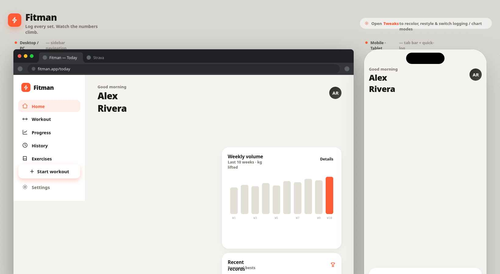
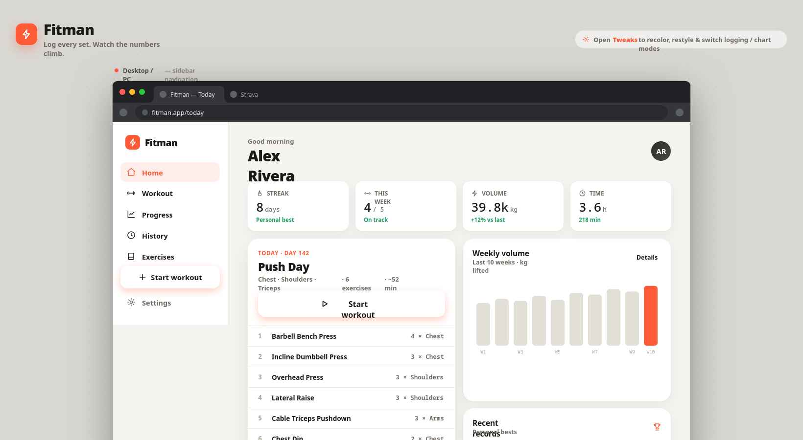
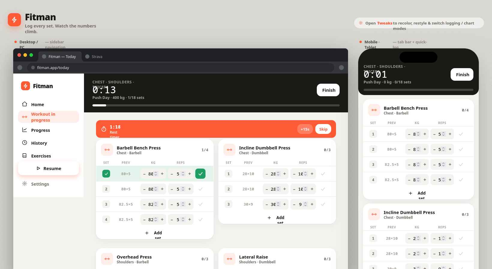
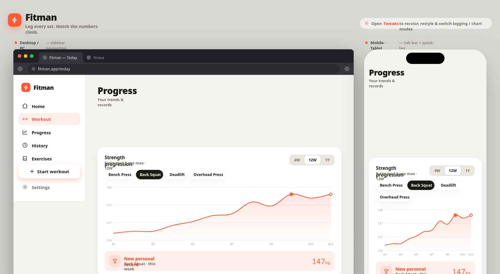

# Design

## Principles

- **Mobile-first** — designed for one hand in a gym. Tap targets are large, inputs are minimal.
- **Clean and light** — warm off-white canvas, white cards, high contrast ink. Easy to read in any lighting.
- **Speed** — you should be able to log a set in under 5 seconds.
- **Glanceable** — the most important info (next exercise, rest timer, last weight) is always visible without scrolling.

## Colour palette

Warm off-white canvas, white cards, near-black ink, single energetic orange-red accent.

| Token | Value | Use |
|---|---|---|
| `--bg` | `#f4f3ef` | Page background |
| `--card` | `#ffffff` | Cards, panels |
| `--ink` | `#1b1a17` | Primary text, headings |
| `--muted` | `#716d64` | Secondary text, labels |
| `--faint` | `#a8a39a` | Placeholder text, icons |
| `--line` | `#eae7e0` | Dividers, borders |
| `--line-strong` | `#ddd9d0` | Stronger borders |
| `--accent` | `#ff5a36` | Buttons, active states, brand |
| `--accent-soft` | 11% accent | Tinted backgrounds, chips |
| `--good` | `#1f9d62` | Completed sets, positive deltas |

## Typography

| Role | Font | Weights |
|---|---|---|
| Body & UI | Hanken Grotesk | 400 · 500 · 600 · 700 · 800 |
| Numbers & data | DM Mono | 400 · 500 |

## Screens

### Overview — desktop + mobile side by side



Desktop uses a left sidebar (Home, Workout, Progress, History, Exercises, Settings). Mobile uses a bottom tab bar with a central FAB button to jump straight into a workout.

---

### 1. Home / Dashboard



Stat strip at the top (streak, workouts this week, volume, time). Today's planned session below with a Start workout button and the exercise list. Weekly volume bar chart and recent personal records alongside.

---

### 2. Active workout



Sticky header showing elapsed time, session name, total volume logged so far, and sets done / total. Rest timer banner appears automatically after completing a set (90 seconds, with +15s and Skip). Each exercise is a card with a `SET | PREV | KG | REPS | ✓` table — steppers for weight and reps, check to mark a set done. Add set button at the bottom of each card.

---

### 3. Progress



Strength progression line chart showing estimated 1RM over time (Epley formula). Lift selector chips (Bench Press, Back Squat, Deadlift, Overhead Press) and time range toggle (4W / 12W / 1Y). Personal record callout beneath the chart. Scrolling down reveals: weekly volume bar chart, body weight line chart with goal line, consistency heatmap (17 weeks), muscle balance chart, and full PR list.

---

## Navigation structure

```
App
├── Dashboard          (home — today's workout + quick stats)
├── Workouts
│   ├── Active Session (when a workout is in progress)
│   └── Plans          (browse/manage programmes)
├── Exercises          (library of all exercises)
├── Progress
│   ├── By Exercise    (e.g. bench press over time)
│   └── Volume         (weekly/monthly totals)
└── History            (log of all past sessions)
```

## Responsive behaviour

On mobile, the sidebar navigation collapses into a bottom tab bar with icons for the five top-level sections. On laptop, the full sidebar is always visible.

```
Mobile bottom bar:
┌─────────────────────────────┐
│  🏠    📋    📈    📅    ⚙️  │
│ Home  Plan  Stats  Log  More │
└─────────────────────────────┘
```
